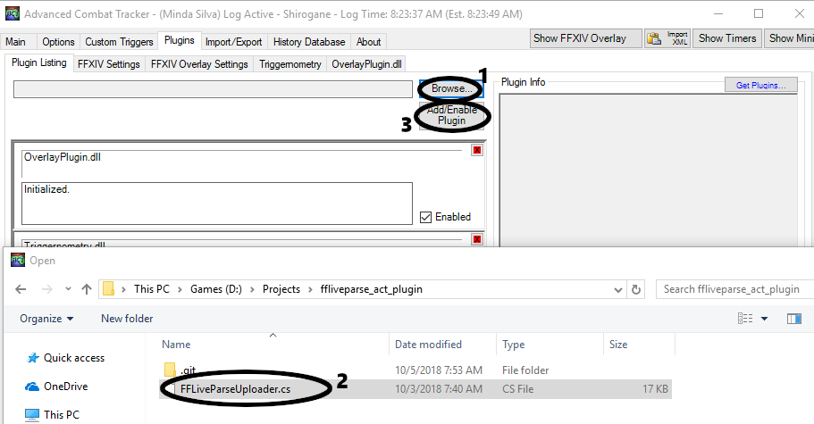
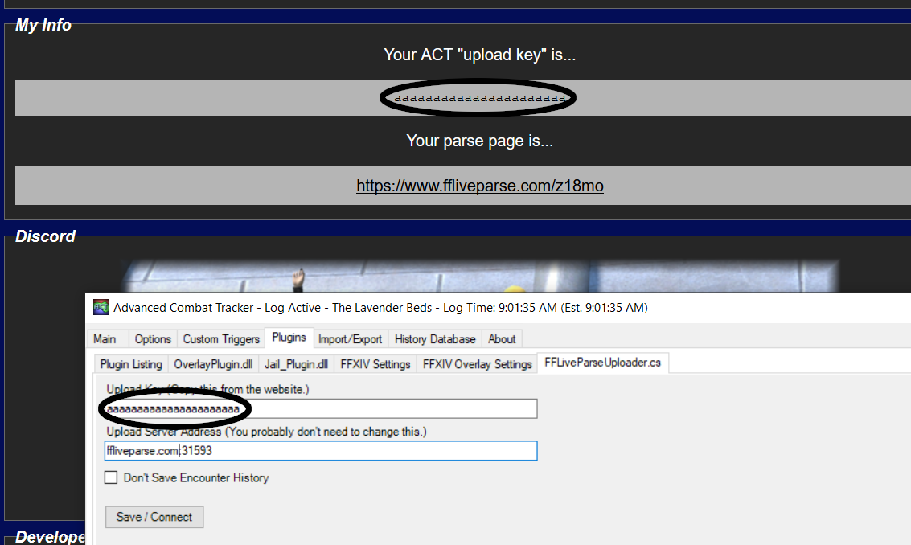

# FFLiveParse - ACT Uploader Plugin

FFLiveParse is a tool for sharing your Final Fantasy XIV log and parse data from Advanced Combat Tracker (ACT) on the web in real time. 

This ACT plugin uploads your parses and log data to the FFLiveParse server.

## Getting Started

1. Visit [ffliveparse.com](ffliveparse.com), click "Click here to generate your upload key."
2. You should now have an ACT upload key as well as a parse page that you can share with others.

1. Download the [ACT plugin](https://github.com/chompy/ffliveparse_act_plugin/releases) if you haven't already. Extract this ZIP. Open ACT and navigate to the plugins tab.
2. Click Browse and locate the 'FFLiveParseUploader.cs' file.
3. Click 'Add/Enable Plugin.'

4. There should be a new tab called "FFLiveParseUploader.cs," click on it.
5. Visit ffliveparse.com, click "Click here to generate your upload key."
6. Paste in the upload key from the web site. Click save. If everything is working the word "Online" should appear in the top left corner of your parse page.

7. Enter the names of all your characters in the 'Character Names' field, seperate each character name with a comma (,). This will ensure all timeline actions can be linked to your parse data. Example... "Character One, Character Two, Character Three." If you skip this step then your actions might appear under "Non-Player Combatant(s)."